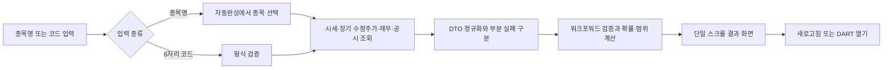
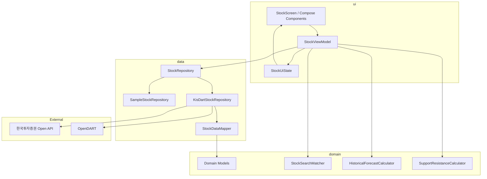

<h1 align="center">K-Value</h1>

<p align="center"><strong>한국 주식의 시세·차트·지지·저항선·검증형 통계 전망·재무·공시 정보를 한 화면에서 확인하는 Android 앱</strong></p>

<p align="center">
  <a href="https://kotlinlang.org/"></a>
  <a href="https://developer.android.com/compose"></a>
  <a href="https://developer.android.com/"></a>
  <a href="#아키텍처"></a>
</p>

K-Value는 종목명 또는 6자리 한국 주식 종목코드를 입력하면 현재가, 최근 100거래일 차트와 지지·저항선, 과거 데이터 기반 통계 전망, 핵심 재무지표, 최근 3년 실적과 DART 공시 경로를 하나의 세로 스크롤 화면에 보여주는 Android 프로젝트입니다.

시세와 재무 수치를 생성형 AI가 만들지 않습니다. 실제 모드에서는 한국투자증권 Open API와 OpenDART 응답을 정규화하고, 통계 전망은 수정주가 OHLCV만 사용하는 결정론적 알고리즘으로 계산합니다. 각 데이터의 출처·기준시점·표본 수와 검증 결과를 함께 공개합니다.

> 통계 전망은 과거 분포를 현재가에 적용한 확률·범위이며 미래 가격을 보장하는 목표주가나 매수·매도 의견이 아닙니다. 방향 모델이 기준 확률을 이기지 못해도 검증된 변동 범위는 유지하고 방향성은 중립으로 표시합니다.

## 프로젝트 목표

- 여러 서비스에 흩어진 시세, 차트, 재무와 공시 경로를 한 번의 조회로 확인합니다.
- 데이터 종류마다 서로 다른 출처와 기준시점을 숨기지 않습니다.
- 일부 선택 API가 실패해도 조회 가능한 영역은 유지하고 누락 항목만 안내합니다.
- 미래 정보를 섞지 않은 시간순 검증으로 과거 데이터의 제한적인 예측력을 평가합니다.
- 네트워크나 API 키 없이도 샘플 Repository로 전체 사용자 흐름을 실행할 수 있게 합니다.
- UI, 상태 관리, 데이터 정규화와 외부 통신의 책임을 분리해 테스트 가능한 구조를 유지합니다.

## 주요 기능

| 영역 | 구현 내용 |
| --- | --- |
| 종목 검색 | 종목명·6자리 종목코드 통합 검색, 250ms 디바운스 자동완성, 최대 8개 추천 |
| 가격 정보 | 현재가, 등락률, 가격 기준시각, 캐시를 우회하는 새로고침 |
| 차트 | 최대 100거래일 수정주가 OHLCV 정규화, 종가 선 차트와 지지·저항선 오버레이 |
| 지지·저항 | 5거래일 국소 고점·저점을 1.5% 이내로 군집화해 현재가에서 0.3% 이상 떨어진 양쪽의 가까운 선을 최대 2개씩 표시 |
| 통계 전망 | 최대 800거래일의 OHLCV로 향후 5거래일 상승·보합·하락 확률과 현재가 적용 변동 범위를 계산 |
| 검증 방어 | 가격 범위 포함률과 방향 확률 Brier Score를 따로 워크포워드 검증하고 방향 미검증 시 중립 표시 |
| 재무 정보 | EPS, PER, PBR, BPS, ROE와 재무 기준기간 |
| 연간 실적 | 최대 3개 연도의 매출, 영업이익과 순이익 |
| 공시 연결 | 종목별 DART 공시 페이지를 시스템 외부 브라우저로 실행 |
| 데이터 안내 | 공급자·기준일·부분 누락·샘플 모드·면책 문구 표시 |
| 화면 상태 | `Idle`, `Loading`, `Success`, `Error`를 명시적으로 렌더링 |

## 사용자 흐름



조회 결과는 다음 순서로 구성됩니다.

1. 종목 검색과 상장 종목 카탈로그 준비 상태
2. 현재가·등락률·가격 기준시각
3. 최근 100거래일 종가 차트와 지지·저항선
4. 5거래일 변동 범위와 검증된 방향 확률 또는 방향성 중립 안내
5. 핵심 재무지표와 최근 3년 실적
6. DART 공시 버튼
7. 데이터 출처·기준일·부분 누락·면책 안내

## 기술적 구현 포인트

### 단방향 상태 흐름

`StockViewModel`이 `StateFlow<StockUiState>`를 단일 상태 원천으로 관리합니다. Composable은 상태를 렌더링하고 이벤트 콜백만 전달하며 Repository나 외부 API를 직접 호출하지 않습니다.

- 동일 종목 로딩 중 중복 요청 차단
- 새 조회 시 이전 `Job` 취소
- 요청 ID 비교를 통한 최신 응답 우선 적용
- 자동완성 디바운스와 오래된 추천 응답 차단
- 새로고침 시 종목 분석 메모리 캐시 우회

### 검증 기반 통계 전망

`HistoricalForecastCalculator`는 생성형 AI나 임의 문장을 사용하지 않고 다음 순서로 항상 같은 입력에 같은 결과를 만듭니다.

1. 양수 수정주가를 날짜 오름차순으로 정렬하고 중복 날짜를 제거합니다.
2. 최근 최대 252개의 5거래일 수익률에 시간 감쇠 가중치를 적용해 10·90백분위 범위를 계산합니다.
3. 방향 모델은 1·5·20·60일 수익률, 20일 이동평균 이격도·변동성, RSI, ATR, 거래량 표준점수, 갭과 일중 범위로 현재 상태를 표현합니다.
4. 표준화 거리가 가까운 과거 구간 40개의 이후 수익률을 상승·보합·하락으로 분류하고 장기 기준 확률 쪽으로 축소한 확률을 계산합니다.
5. 현재가에는 방향 모델과 독립적인 변동 범위를 항상 적용하고, 방향 확률은 검증을 통과한 경우에만 표시합니다.

검증은 각 평가 시점보다 최소 5거래일 이전에 결과가 확정된 과거 표본만 사용합니다. 변동 범위는 목표 80% 범위의 실제 포함률을 측정합니다. 방향 모델은 과거 빈도로 만든 기준 확률과 다중 클래스 Brier Score를 비교하고, 최소 20회의 평가와 시간순 3개 구간 중 2개 이상의 개선을 요구합니다.

최소 입력은 180거래일입니다. 방향 모델이 기준을 이기지 못하거나 완전한 OHLCV가 없으면 확률을 숨기고 `방향성 중립`으로 표시하지만, 계산 가능한 5거래일 변동 범위와 범위 검증 결과는 계속 제공합니다. 높은 신뢰도나 확정적 가격은 표시하지 않습니다.

### 지지·저항선

`SupportResistanceCalculator`는 최근 최대 100거래일의 수정주가 고가·저가를 사용하며, 고가·저가가 누락된 날은 실제 종가를 사용했다는 가정을 화면에 공개합니다. 5거래일 창에서 확인한 국소 고점·저점과 20·60·100거래일 및 전체 표본 극값을 모은 뒤, 서로 1.5% 이내인 가격을 하나의 반응 수준으로 묶습니다. 현재가와 0.3% 이상 떨어진 수준 중 아래의 가까운 값은 지지선, 위의 가까운 값은 저항선으로 각각 최대 2개 표시합니다.

차트에서는 지지와 저항을 서로 다른 점선으로 표시하고, 텍스트 영역에는 가격, 현재가 대비 거리, 과거 반응 횟수, 표본 수와 기준일을 함께 제공합니다. 20거래일 미만이거나 현재가와 구분되는 수준이 없으면 임의의 선을 만들지 않고 계산 불가 사유를 표시합니다. 이 값은 과거 가격 반응을 요약한 후행 지표이며 돌파·이탈이나 미래 가격을 보장하지 않습니다.

### 필수 실패와 부분 실패 분리

현재가는 결과 화면에 필요한 필수 데이터입니다. 차트, 재무비율, 연간 실적과 DART 연결은 독립적인 선택 데이터로 처리합니다. 선택 호출이 실패하면 성공한 영역은 그대로 표시하고 `MissingDataSection`으로 누락 영역을 안내합니다.

### 외부 데이터 정규화

`StockDataMapper`가 공급자 DTO를 UI와 분리된 `StockAnalysis`로 변환합니다.

- 문자열 숫자를 유한한 숫자 타입으로 변환
- 일봉 날짜 오름차순 정렬과 중복 날짜 제거
- 전망 검증용 일봉 최대 800개 보존과 차트 표시용 최근 100개 분리
- 결산월 기준 최신 연간 재무비율 선택
- 억원 단위 손익 데이터를 원 단위로 변환
- 최대 3개 연도 실적 정렬
- 데이터 종류별 독립 기준시점과 부분 누락 보존

### 캐시와 네트워크 복원력

- 종목 분석 결과 60초 메모리 캐시
- KIS 접근 토큰 메모리·앱 전용 저장소 캐시와 만료 전 갱신
- 일시적인 서버 오류 재시도와 KIS 요청 간격 적용
- 실 API 수정주가를 120일 달력 구간으로 나눠 최근 약 3년까지 수집하고, 오래된 구간 실패 시 확보된 최근 데이터로 안전하게 축소
- OpenDART 상장사 원본 7일 파일 캐시
- 상장 종목 경량 인덱스 재사용
- OpenDART 갱신 실패 시 사용 가능한 이전 캐시로 폴백

### 접근성

상승·하락과 지지·저항은 색상뿐 아니라 부호와 문구로 함께 표현합니다. 차트에는 거래일 수, 최저·최고가, 기간 변화와 지지·저항 가격 요약을 제공하며 핵심 컨트롤에는 안정적인 `testTag`가 있습니다. 사용자 문구는 문자열 리소스에서 관리합니다.

## 아키텍처



| 계층 | 책임 |
| --- | --- |
| `ui` | Compose 렌더링, 사용자 이벤트 전달, 화면 상태와 요청 생명주기 관리 |
| `domain` | 원본 단위 도메인 모델, 종목 검색 매칭, 지지·저항과 워크포워드 통계 전망 계산 |
| `data` | Repository 추상화, 샘플/실 API 선택, DTO 정규화, 캐시와 부분 실패 처리 |
| `common` | 오류 범주, 숫자 포매팅, 종목코드 검증과 민감정보를 제외한 진단 로깅 |

## 데이터 소스와 실행 모드

| 소스 | 사용 데이터 | 처리 방식 |
| --- | --- | --- |
| [한국투자증권 Open API](https://apiportal.koreainvestment.com/) | 현재가, 약 3년 수정주가 일봉 OHLCV, 재무비율, 손익계산서 | 100건 한도를 고려한 날짜 구간 조회와 부분 실패 처리 |
| [OpenDART](https://opendart.fss.or.kr/) | 상장사 고유번호 목록, 종목명 검색, 공시 연결 | ZIP 원본과 경량 인덱스를 앱 캐시에 저장 |
| Sample Repository | 삼성전자(`005930`) 예제 데이터 | API 키가 없을 때 검색부터 결과 화면까지 제공 |

세 API 설정값이 모두 있으면 실 API Repository를, 하나라도 없으면 Sample Repository를 선택합니다. Sample 데이터는 실제 투자 데이터가 아니며 화면 하단에 별도로 표시됩니다.

## 기술 스택

| 구분 | 기술 |
| --- | --- |
| Language | Kotlin 2.2.10 |
| UI | Jetpack Compose, Material 3 |
| State | ViewModel, StateFlow, Kotlin Coroutines |
| Network | OkHttp 5.4.0, kotlinx.serialization JSON |
| Architecture | Single Activity, UDF, Repository Pattern, UI·Domain·Data 분리 |
| Test | JUnit 4, Compose UI Test, AndroidX Test, Espresso |
| Build | Gradle 9.4.1, Android Gradle Plugin 9.2.1 |
| Android | minSdk 31, targetSdk 37, compileSdk 37 |

## 프로젝트 구조

```text
KValue/
├─ app/src/main/java/com/chlqudco/kvalue/
│  ├─ common/                 오류·포매팅·입력 검증·로깅
│  ├─ data/                   Repository와 샘플/실 API 구현
│  │  ├─ mapper/              외부 DTO → 도메인 모델 정규화
│  │  └─ remote/              KIS·OpenDART 데이터 소스
│  ├─ domain/                 검색 매처·지지·저항·통계 전망 계산기·도메인 모델
│  ├─ ui/                     화면 상태·ViewModel·Compose 화면
│  │  ├─ components/          가격 차트·통계 전망·재무 카드
│  │  └─ theme/               Material 3 테마
│  └─ MainActivity.kt
├─ app/src/test/              검증기·검색·매퍼 JVM 단위 테스트
├─ app/src/androidTest/       Compose UI·앱 컨텍스트 테스트
├─ IMPLEMENTATION_NOTES.md    주요 구현 결정 기록
└─ gradle/libs.versions.toml  의존성 버전 카탈로그
```

## 시작하기

### 요구 환경

- Android Studio와 Android SDK 37
- Gradle을 실행할 JDK 17 이상
- Android 12(API 31) 이상 에뮬레이터 또는 기기

### 저장소 받기

```bash
git clone https://github.com/chlqudco/KValue.git
cd KValue
```

### Sample 모드 실행

API 키를 설정하지 않고 앱을 실행한 뒤 `삼성전자` 또는 `005930`을 조회합니다. 네트워크 없이 검색, 로딩, 가격, 차트와 지지·저항선, 확률·범위 전망, 재무, 공시 버튼과 출처 영역을 확인할 수 있습니다.

### 실제 API 연결

개인 개발용 `local.properties`에 다음 값을 추가합니다. 이 파일은 Git에서 제외됩니다.

```properties
KIS_APP_KEY=your_kis_app_key
KIS_APP_SECRET=your_kis_app_secret
OPEN_DART_API_KEY=your_open_dart_api_key
```

세 값을 모두 설정한 debug 빌드에서 실 API Repository가 활성화됩니다. release 빌드는 개인 비밀값이 포함되지 않도록 키를 빈 값으로 강제하며 Sample 모드로 동작합니다.

### 빌드와 테스트

Windows PowerShell:

```powershell
.\gradlew.bat testDebugUnitTest
.\gradlew.bat lintDebug
.\gradlew.bat assembleDebug
```

연결된 에뮬레이터 또는 기기에서 UI 테스트:

```powershell
.\gradlew.bat connectedDebugAndroidTest
```

macOS 또는 Linux에서는 `./gradlew`를 사용합니다.

## 테스트 범위

| 대상 | 주요 검증 내용 |
| --- | --- |
| 종목코드 검증 | 빈 값, 잘못된 형식과 6자리 숫자 코드 |
| 종목 검색 | 이름·코드 매칭, 정확 일치와 추천 개수 제한 |
| 통계 전망 | 최소 표본, 잘못된 가격, OHLCV 누락, 확률 합계, 범위 순서, 방향 Brier 검증과 미검증 시 범위 유지 |
| 지지·저항 | 최소 표본, 잘못된 현재가, 날짜 정렬·중복 제거, 최대 표본, 양쪽 수준과 평탄 가격 처리 |
| 데이터 매핑 | 숫자·단위 변환, 날짜 정렬·중복 제거, 100일 차트·장기 전망 표본 분리, 최신 재무기간, 부분 데이터 누락 |
| Compose UI | 자동완성 선택, 가격·차트·통계 전망·재무·DART 노출, 삭제된 가치평가 항목 미노출 |

## 보안과 배포 제한

- App Key, App Secret과 접근 토큰은 소스·리소스·테스트 픽스처·로그에 저장하지 않습니다.
- `local.properties` 주입은 개인 POC 편의를 위한 방식이며 APK 내부의 비밀값을 안전하게 보호하지 못합니다.
- 공개 배포 전에는 백엔드 프록시, 키 회전, 요청 제한, 시세 이용 조건과 관련 규제를 별도로 검토해야 합니다.
- 로그에는 공급자, 호출 단계, 지연시간과 오류 범주만 남기고 키·토큰·API 응답 원문은 기록하지 않습니다.

## 현재 범위

현재 저장소는 Android 단일 화면 MVP와 개인 API 연동 POC에 집중합니다. 다음 기능은 포함하지 않습니다.

- GPT 또는 다른 생성형 AI 기반 분석
- 종합 참고 분석, 단순 PER 참고가와 S-RIM 참고가
- 하나의 확정 목표주가, 매수·매도 의견과 수익 보장
- KOSPI·업종·수급·뉴스·거시지표를 결합한 다변량 모델
- 거래비용·슬리피지·세금을 반영한 매매전략 백테스트
- 로그인, 계좌 연동, 주문·자동매매
- 뉴스, 알림, 커뮤니티, 결제와 실시간 WebSocket

공개 서비스로 확장하려면 백엔드 프록시, 운영 인증, 영속 캐시, 실제 기기 접근성·성능 검증, 데이터 라이선스와 금융 관련 고지 검토가 필요합니다.

## 면책

이 프로젝트는 학습 및 포트폴리오 목적으로 제작되었습니다. 통계 전망은 과거 데이터에서 관찰된 제한적인 패턴이며 시장 구조 변화, 거래비용, 유동성, 뉴스와 공시 충격을 미리 알 수 없습니다. 표시되는 시세·재무·공시 데이터와 전망은 정확성이나 수익을 보장하지 않으며 실제 투자 판단의 근거로 단독 사용해서는 안 됩니다.
